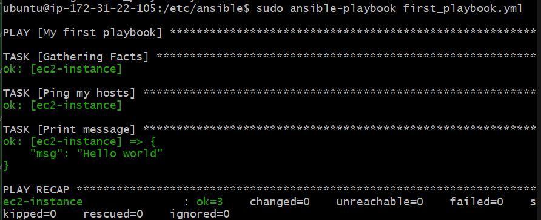

# Ansible setup and commands

# Ansible

## What is ansible? 

**Ansible** is an open-source automation tool used for:

- Configuration Management 
- Application Deployment 
- Provisioning Infrastructure 
- Orchestration 

It helps automate repetitive tasks and ensure systems are set up and managed consistently — all using simple, human-readable code written in YAML. 

***Ansible is***: 
- ***Agentless***: You don’t need to install anything on the remote machines. It uses SSH to connect and run tasks.
- ***Declarative + Simple***: You describe what you want, not how to do it. Uses YAML (called Playbooks) which are easy to read and write.
- ***Idempotent***: Running the same Ansible playbook multiple times won’t cause problems — it’ll only make changes if needed.

## How does ansible work?

- ***Inventory***: A list of target servers (like web, db, etc.).
- ***Playbooks***: YAML files defining the tasks you want to run.
- ***Modules***: Built-in or custom pieces of logic that do specific tasks (e.g., install packages, manage users, copy files).
- ***Connection***: Ansible uses SSH to talk to the remote machines and run tasks.
- ***Execution***: You run a command like ansible-playbook myfile.yml


- ***Playbook***: YAML file that defines a series of tasks to automate configuration, deployment, or orchestration on your infrastructure. 
Unlike ad-hoc commands, which are one-liners for quick tasks, playbooks are structured, repeatable, and version-controllable. Used for managing complex systems or multiple steps
- ***Inventory***: A file (or script) that defines the hosts and groups of hosts on which your Ansible playbooks or ad-hoc commands will run. Defines: which machines to connect to, how to connect to them (username, port, etc.) and how they are grouped

----
# Ansible setup

## Instances

First we have to ***setup 2 EC2 instances***

Configuration:
1. - tech503-james-ansible-controller
   - ubuntu 22.04
   - t2.micro
   - key-pair: the usual
   - security group: port 22 (basic sg has this, ssh port)
   - launch
-----------
2. - tech503-james-ansible-target-node
   - other stuff: same as the above

-----
## Controller setup commands

### First git bash window (controller)
***Connect to the controller instance*** on a git bash window via ssh. 

Then ***run the below commands***:

***Note***: The explanations of the commands are commented out in the code block

```
#Check pthon installed
python3 --version

#Update and upgrade
sudo apt update -y
sudo DEBIAN_FRONTEND=noninteractive apt upgrade -y

#Add ansible to the list of packages (requires ENTER as manual input)
sudo DEBIAN=FRONTEND_noninteractive apt-add-repository ppa:ansible/ansible

#Install ansible
sudo DEBIAN_FRONTEND=noninteractive apt install ansible -y

#Check it worked by entering ansible directory
ansible --version
cd /etc
cd ansible
ls
```

The ```ls``` should output:

```ansible.cfg  hosts  roles```

As the list of files in the directory

If it worked, ***continue with the following***:

```
#cd into the .ssh folder
cd
cd .ssh

#Add your aws private key to the instance
sudo nano tech503-james-aws-key.pem
```
----
### Second git bash window

In new git bash window, go to your local ```.ssh``` folder and use ```cat``` on your ```tech503-james-aws-key.pem``` key and paste the output in your new key on the first git bash window.

----
### First git bash window (controller)
Continue with the below commands:

***Give the aws key read access***:
```
sudo chmod 400 tech503-james-aws-key.pem
```

***Check SSH connection works***:

From within your controller instance, ssh into the target instance:
```
#SSH from controller to target using command from EC2 instance aws page

#The below is an example ssh command
sudo ssh -i "tech503-james-aws-key.pem" ubuntu@ec2-34-248-223-157.eu-west-1.compute.amazonaws.com

#Check you are in target
ansible --version
#Shouldn't be installed on target

#go back to controller
exit
```

***Change the configuration of ansible***:
```
#Move to right directory
cd
cd /etc/ansible

#Edit the list of hosts
sudo nano hosts
```

***Add the below to the bottom of the file*** (the placeholders will need replacing):
```
[web]
ec2-instance ansible_host=<target-public-ip-adress> ansible_user=ubuntu ansible_ssh_private_key_file=/home/ubuntu/.ssh/<placeholder-key-name>
```

Here ```ec2-instance``` is the name you give to the instance, so you can reference it later

Then, ping the target instance to ***test the connection***:
```
sudo ansible all -m ping
```
All can be changed to the group name to only ping a specific group

This should now work and you should get a ```"ping": "pong"``` message

(Optional): Get rid of the pink warning message:
```
sudo nano ansible.cfg

#Add this to the bottom
[defaults]
interpreter_python = auto_silent
```

***The connection between the controller and the target node should now be established. This means we can give commands for the target node to carry out from the controller.***

----
## Useful commands

```
#Give representation of the hosts tree
ansible-inventory --list
ansible-inventory --graph
```

```
#Gives the Linux version of the target node
sudo ansible web -a "uname -a"
```
***Runs the command in quotes on the target instance*** (the target instance/instances in this case being the web group)

```
#Update
sudo ansible web -m ansible.builtin.apt -a "update_cache=yes" --become

#Upgrade
sudo ansible web -m ansible.builtin.apt -a "upgrade=dist" --become
```

***Command breakdown***:
- ```sudo ansible web```: Perform ad-hoc command on ```web``` group
- ```-m ansible.builtin.apt```: This tells Ansible to use the ```apt``` module (part of Ansible's built-in collection).
- ```-a```: Arguments
- ```"upgrade=dist"```: The upgrade command
- ```--become```: Ansible performs privilege escalation on the remote hosts. ***Basically it is a remote version of ```sudo```***. Without it, ansible would try to run commands as the default user (in this case ubuntu)

You can control how many hosts Ansible configures in parallel using the ```forks``` setting in ```ansible.cfg```:
- Default is 5.
- Set it higher to make Ansible faster across many hosts.

***Copying the private key to the target instance***:
```
#Copy the key to the target (Don't use this one)
sudo ansible web -m ansible.builtin.copy -a "src=/home/ubuntu/.ssh/tech503-james-aws-key.pem dest=/home/ubuntu/.ssh/tech503-james-aws-key.pem mode=0400" --become

#Alternative
sudo ansible web -m ansible.builtin.copy -a "src=/home/ubuntu/.ssh/tech503-james-aws-key.pem dest=/home/ubuntu/.ssh/tech503-james-aws-key.pem"

#Check it worked
sudo ansible web -a "ls ~/.ssh"
```
- Mode: The permissions given to the copy of the private key

***Deploying nginx on target node***:
```
#Install nginx
sudo ansible web -m apt -a "name=nginx state=present update_cache=yes" -b

#Start and enable nginx
sudo ansible web -m systemd -a "name=nginx state=started enabled=yes" -b

#May still need to do port config
```

## Playbooks

[Documentation](https://docs.ansible.com/ansible/latest/playbook_guide/playbooks_intro.html)

In ansible.cfg file, add the below to the bottom:
```host_key_checking = False```

***Playbooks go in the ```/etc/ansible``` directory***

***Running a playbook***:
```sudo ansible-playbook <playbook-name> --become```

Example output:


Check for syntax errors:
```ansible-playbook --syntax-check <playbook-filename>```

Dry run of playbook:
```sudo ansible-playbook --check install_nginx_playbook.yml```

## App setup

- Add app group and DB group to the hosts file
- Use the launch_db_playbook
- Use the launch_app_playbook

The launch app playbook currently doesn't seed the database so that needs to be done manually


